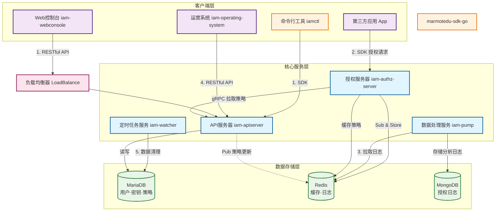
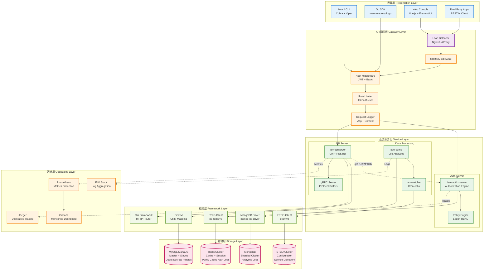
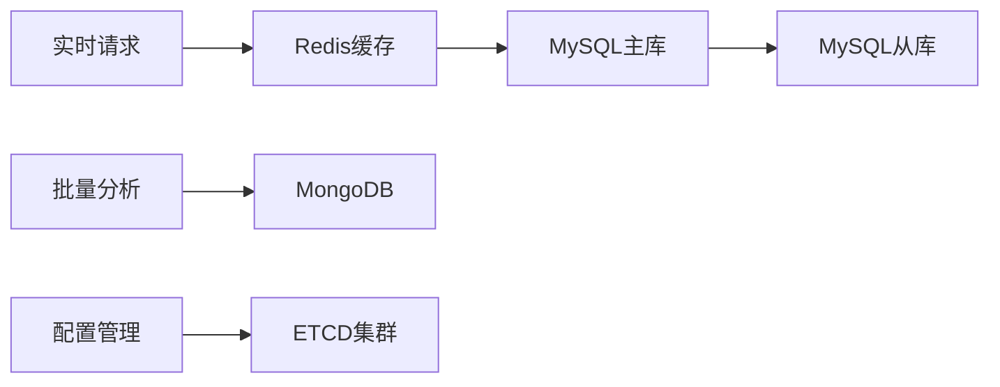
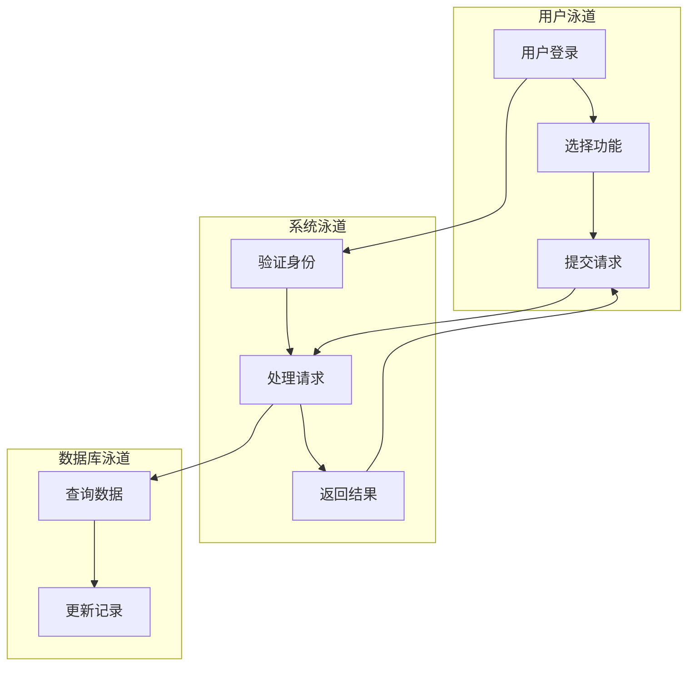
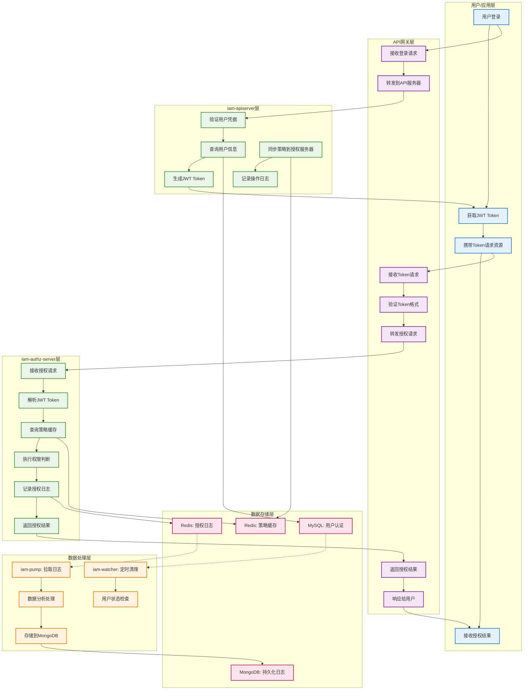
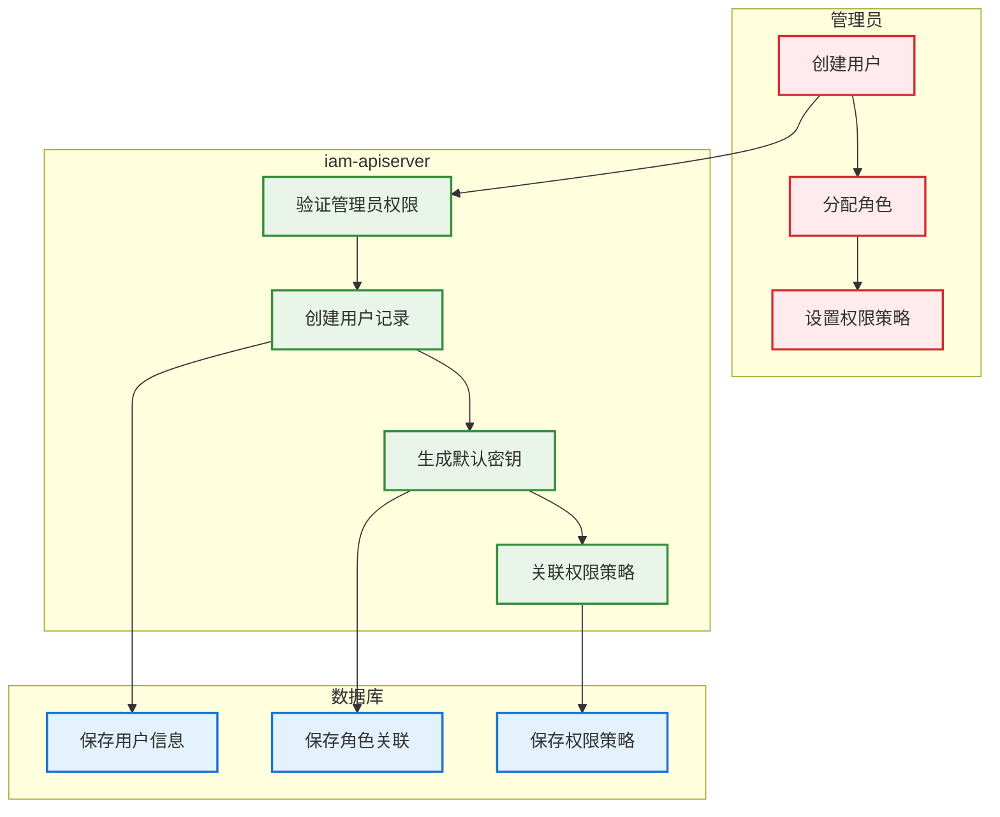
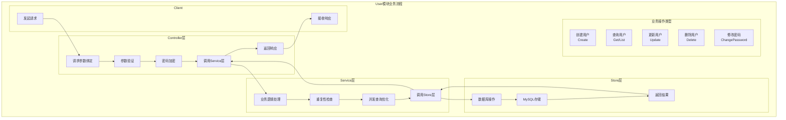
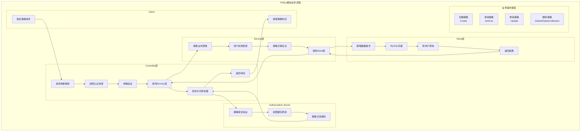
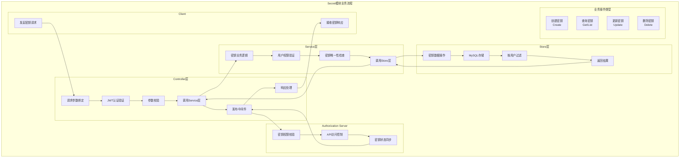

# 解释这个项目, 帮助我快速上手

我来帮你快速了解这个项目。让我先查看项目结构和关键文件来为你提供全面的介绍。

⏺ Update Todos
  ⎿  ☐ 查看项目根目录结构        
     ☐ 阅读README文档了解项目概述
     ☐ 检查配置文件和依赖
     ☐ 查看主要代码结构
     ☐ 了解API接口设计

⏺ Update Todos
  ⎿  ☐ 查看项目根目录结构        
     ☐ 阅读README文档了解项目概述
     ☐ 检查配置文件和依赖
     ☐ 查看主要代码结构
     ☐ 了解API接口设计

⏺ List(.)
  ⎿  Listed 820 paths (ctrl+r to expand)

⏺ Read(README.md)
  ⎿  Read 91 lines (ctrl+r to expand)

⏺ Read(study.md)
  ⎿  Error: File does not exist.

⏺ Update Todos
  ⎿  ☒ 查看项目根目录结构        
     ☐ 阅读README文档了解项目概述
     ☐ 检查配置文件和依赖
     ☐ 查看主要代码结构
     ☐ 了解API接口设计

⏺ Read(go.mod)
  ⎿  Read 149 lines (ctrl+r to expand)

⏺ Read(Makefile)
  ⎿  Read 50 lines (ctrl+r to expand)

⏺ Update Todos
  ⎿  ☒ 查看项目根目录结构        
     ☒ 阅读README文档了解项目概述
     ☒ 检查配置文件和依赖
     ☐ 查看主要代码结构
     ☐ 了解API接口设计

⏺ Read(cmd)
  ⎿  Error: EISDIR: illegal operation on a directory, read

⏺ List(internal)
  ⎿  Listed 334 paths (ctrl+r to expand)

⏺ Read(docs/guide/zh-CN/installation/installation-architecture.md)
  ⎿  Read 30 lines (ctrl+r to expand)

⏺ Update Todos
  ⎿  ☒ 查看项目根目录结构        
     ☒ 阅读README文档了解项目概述
     ☒ 检查配置文件和依赖
     ☒ 查看主要代码结构
     ☒ 了解API接口设计

⏺ IAM - 身份识别与访问管理系统快速上手指南

  项目概览

  IAM (Identity and Access Management)
  是一个基于Go语言开发的企业级身份识别与访问管理系统，当前稳定版本为 v1.6.2。

  核心架构

  主要组件

  - iam-apiserver - 核心API服务器，提供用户、密钥和策略的RESTful API
  - iam-authz-server - 授权服务器，处理资源访问授权请求
  - iam-pump - 数据处理服务，分析授权日志存储到MongoDB
  - iam-watcher - 定时任务服务，处理数据清理和用户管理
  - iamctl - 命令行客户端工具

  技术栈

  - 语言: Go 1.21.4
  - Web框架: Gin
  - 数据库: MySQL (主存储) + Redis (缓存) + MongoDB (日志)
  - 认证: JWT + Basic Auth
  - API: RESTful + gRPC

  快速开始

  1. 环境要求

  - CentOS Linux 8.x (推荐)
  - Go 1.21.4+
  - 服务器需要访问外网

  2. 构建项目

  # 克隆代码
  git clone https://github.com/marmotedu/iam $GOPATH/src/github.com/marmotedu/iam

  # 编译
  cd $GOPATH/src/github.com/marmotedu/iam
  make

  3. 部署

  参考文档：docs/guide/zh-CN/installation/README.md

  项目结构

  iam/
  ├── cmd/                 # 主程序入口
  │   ├── iam-apiserver/   # API服务器
  │   ├── iam-authz-server/# 授权服务器
  │   ├── iam-pump/        # 数据处理服务
  │   ├── iam-watcher/     # 定时任务服务
  │   └── iamctl/          # 命令行工具
  ├── internal/            # 内部实现代码
  │   ├── apiserver/       # API服务器实现
  │   ├── authzserver/     # 授权服务器实现
  │   ├── pump/           # 数据处理实现
  │   ├── watcher/        # 任务调度实现
  │   └── pkg/            # 内部公共包
  ├── pkg/                # 外部可用包
  ├── configs/            # 配置文件
  ├── docs/              # 文档
  └── scripts/           # 脚本工具

  常用命令

  # 编译所有组件
  make build

  # 运行测试
  make test

  # 生成文档
  make gen.doc

  # 代码格式化
  make format

  # 代码检查
  make lint

  核心功能

  - 用户身份管理 (增删改查)
  - 访问密钥管理
  - 授权策略管理
  - 资源访问授权
  - 审计日志记录
  - 分布式缓存
  - 高可用部署

  学习资源

  - docs/guide/zh-CN/
  - docs/guide/zh-CN/api/
  - https://time.geekbang.org/column/intro/100079601
  - docs/guide/zh-CN/installation/

  这是一个成熟的企业级项目，适合学习Go语言企业开发最佳实践。

  
# 项目业务架构图

 架构分层

  架构图分为两个主要流向：
  - 数据流（左侧）：处理授权请求和日志数据
  - 控制流（右侧）：管理用户、策略和系统配置

  核心组件及数据流向

  1. 管理控制流程
  - iam-webconsole：Web管理控制台 → RESTful API → iam-apiserver
  - iamctl：命令行工具 → SDK → iam-apiserver
  - iam-operating-system：运营系统 → RESTful API → iam-apiserver

  2. 授权数据流程
  - App：第三方应用 → SDK → iam-authz-server (授权请求)
  - iam-authz-server ↔ Redis：缓存策略和日志
  - iam-authz-server ← gRPC ← iam-apiserver：拉取策略数据

  3. 数据处理流程
  - iam-pump：从Redis拉取日志 → 存储至MongoDB
  - iam-watcher：定时任务处理MariaDB数据清理

  4. 数据存储层
  - MariaDB：持久化存储用户、密钥、策略
  - Redis：缓存授权策略和日志数据
  - MongoDB：存储分析后的授权日志

  关键特性

  - 负载均衡：支持多实例部署，通过LoadBalance分发请求
  - 数据分离：读写分离，授权服务独立缓存提升性能
  - 异步处理：日志处理和数据清理异步执行
  - 多接口：支持RESTful API、gRPC、SDK等多种访问方式

  业务流程

  1. 用户通过Web控制台或命令行管理资源
  2. 第三方应用通过SDK请求资源授权
  3. 授权服务查询缓存策略进行授权决策
  4. 授权日志异步处理和存储
  5. 运营系统查看授权数据和系统监控




  架构流程说明

  🔄 数据流向详解

  1️⃣ 管理控制流
  - Web控制台/运营系统 → RESTful API → 负载均衡器 → iam-apiserver
  - 命令行工具 iamctl → SDK → iam-apiserver
  - iam-apiserver ↔ MariaDB（CRUD操作）

  2️⃣ 授权数据流
  - 第三方应用 → SDK → iam-authz-server（授权请求）
  - iam-authz-server ↔ Redis（缓存策略、存储日志）
  - iam-authz-server ← gRPC ← iam-apiserver（同步策略）

  3️⃣ 日志处理流
  - iam-pump → Redis（拉取日志）→ 分析处理 → MongoDB

  4️⃣ 定时维护流
  - iam-watcher → MariaDB（数据清理、用户管理）

  🏗️ 架构特点

  | 特性   | 说明                 |
  |------|--------------------|
  | 高可用  | 负载均衡 + 多实例部署       |
  | 高性能  | Redis缓存 + 读写分离     |
  | 可扩展  | 微服务架构，组件独立         |
  | 异步处理 | 日志和清理任务异步执行        |
  | 多接口  | RESTful、gRPC、SDK支持 |

  💾 存储分层

  - MariaDB: 主数据存储（用户、密钥、策略）
  - Redis: 高性能缓存（策略缓存、授权日志）
  - MongoDB: 海量日志存储（授权记录分析）

  这个架构图清晰地展现了IAM系统的核心业务流程和技术架构设计。


# 项目技术架构图



## 🏗️ 技术架构说明

### 分层架构设计

#### 1️⃣ 表现层 (Presentation Layer)
| 组件 | 技术栈 | 职责 |
|------|-------|------|
| **Web Console** | Vue.js + Element UI | 管理界面，用户友好的操作界面 |
| **iamctl CLI** | Cobra + Viper | 命令行工具，运维和管理操作 |
| **Go SDK** | marmotedu-sdk-go | 开发者集成包，简化API调用 |
| **Third Party Apps** | RESTful Client | 第三方应用接入 |

#### 2️⃣ API网关层 (Gateway Layer)
```go
// 中间件处理链
Request → Load Balancer → CORS → Auth → Rate Limit → Logger → Service
```

| 中间件 | 功能 | 技术实现 |
|-------|------|---------|
| **负载均衡** | 请求分发、健康检查 | Nginx/HAProxy |
| **认证授权** | JWT验证、Basic Auth | gin-jwt/v2 |
| **限流控制** | Token Bucket算法 | golang.org/x/time/rate |
| **请求日志** | 结构化日志记录 | Zap + Context |

#### 3️⃣ 业务服务层 (Service Layer)

**iam-apiserver 核心模块**
```go
// 代码结构
internal/apiserver/
├── controller/v1/    # 控制器层
│   ├── user/        # 用户管理
│   ├── secret/      # 密钥管理  
│   └── policy/      # 策略管理
├── service/v1/      # 业务逻辑层
├── store/           # 数据访问层
│   ├── mysql/       # MySQL实现
│   ├── etcd/        # ETCD实现
│   └── fake/        # 测试实现
└── options/         # 配置选项
```

**iam-authz-server 授权引擎**
```go
// 授权流程
Request → JWT验证 → 策略匹配 → 权限判断 → 审计日志 → Response
```

#### 4️⃣ 框架层 (Framework Layer)
| 框架/库 | 版本 | 用途 |
|---------|------|------|
| **Gin** | v1.7.4 | HTTP路由和中间件 |
| **GORM** | v1.22.4 | ORM数据库操作 |
| **go-redis** | v8.11.4 | Redis客户端 |
| **mongo-driver** | 官方驱动 | MongoDB操作 |
| **etcd/clientv3** | v3.5.0 | 配置中心客户端 |

#### 5️⃣ 存储层 (Storage Layer)

**数据分层存储策略**


| 存储 | 用途 | 特性 |
|------|------|------|
| **MySQL** | 主数据存储 | ACID事务、主从复制 |
| **Redis** | 缓存+会话 | 高性能、持久化 |
| **MongoDB** | 日志分析 | 分片集群、灵活文档 |
| **ETCD** | 配置中心 | 强一致性、服务发现 |

#### 6️⃣ 运维层 (Operations Layer)

**可观测性三支柱**
- **Metrics**: Prometheus收集性能指标
- **Tracing**: Jaeger分布式链路追踪  
- **Logging**: ELK Stack日志聚合分析

### 🔧 核心技术特性

#### 高可用设计
- **无状态服务**: 服务实例可水平扩展
- **数据库集群**: 主从复制、读写分离
- **缓存集群**: Redis Cluster模式
- **负载均衡**: 多实例健康检查

#### 高性能优化
- **连接池**: 数据库连接复用
- **缓存策略**: 多级缓存（本地+分布式）
- **异步处理**: 日志和统计任务解耦
- **批量操作**: 减少数据库交互次数

#### 安全性保障
- **认证机制**: JWT + Basic Auth双重认证
- **权限控制**: RBAC细粒度授权
- **数据加密**: 敏感数据AES加密存储
- **安全审计**: 完整的操作日志追踪

这个技术架构图展现了IAM系统完整的技术栈和分层设计，是学习企业级Go项目架构的优秀范例。

## 🏊‍♀️ IAM业务流程泳道图



### 用户认证授权流程



### 🔄 流程说明

#### 认证流程 (Authentication Flow)
1. **用户登录** → API网关 → iam-apiserver
2. **验证凭据** → 查询MySQL用户数据
3. **生成JWT** → 返回给用户
4. **策略同步** → 推送到iam-authz-server缓存

#### 授权流程 (Authorization Flow)  
1. **携带Token请求资源** → API网关验证
2. **转发授权请求** → iam-authz-server
3. **JWT解析验证** → 查询Redis策略缓存
4. **权限判断** → 返回授权结果
5. **记录日志** → 存储到Redis

#### 异步处理流程 (Async Processing)
1. **iam-pump** → 从Redis拉取授权日志
2. **数据分析** → 存储到MongoDB
3. **iam-watcher** → 定时清理过期数据

### 泳道图特点
- **清晰分层**: 每个泳道代表不同的系统层次
- **流程可视**: 直观展现数据流向和处理步骤  
- **异步处理**: 虚线表示异步操作
- **颜色区分**: 不同颜色代表不同系统组件

## 🎯 其他业务流程泳道图

### 用户管理流程



这样的泳道图清晰地展现了IAM系统中不同角色和组件之间的交互流程，非常适合系统设计文档和技术交流。

# 业务模块
IAM项目代码结构，我可以看到这个项目主要包含以下几个业务模块：

  3个核心业务模块

  1. User（用户管理） - 用户的创建、删除、更新、查询、密码修改等功能
  2. Policy（策略管理） - 权限策略的创建、删除、更新、查询等功能
  3. Secret（密钥管理） - API密钥的创建、删除、更新、查询等功能

  4个系统服务模块

  1. iam-apiserver - API服务器，提供REST API接口
  2. iam-authz-server - 授权服务器，处理授权逻辑
  3. iam-pump - 数据泵服务，负责数据分析和导出
  4. iam-watcher - 监控服务，负责系统监控和清理任务

  1个命令行工具模块

  1. iamctl - 命令行客户端工具，用于管理IAM系统

  总共有8个模块，其中3个是核心业务功能模块，4个是系统服务模块，1个是客户端
  工具模块。


# 业务模块泳道图

1. User模块业务泳道图



⏺ 2. Policy模块业务泳道图



⏺ 3. Secret模块业务泳道图



⏺ 以上就是IAM项目三个核心业务模块的业务泳道图：

  1. User模块：负责用户生命周期管理，包括创建、查询、更新、删除和密码修改
  2. Policy模块：负责权限策略管理，与授权服务器协调处理权限控制
  3. Secret模块：负责API密钥管理，为API访问提供安全认证

  每个模块都遵循Controller→Service→Store的三层架构，并与Authorization
  Server进行权限验证和状态同步。