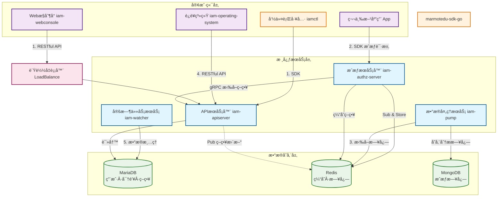
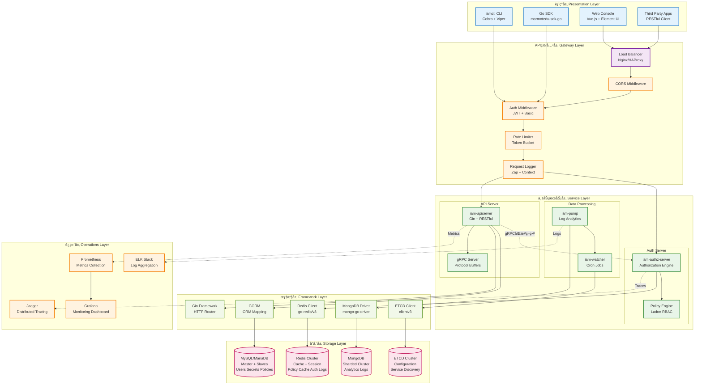
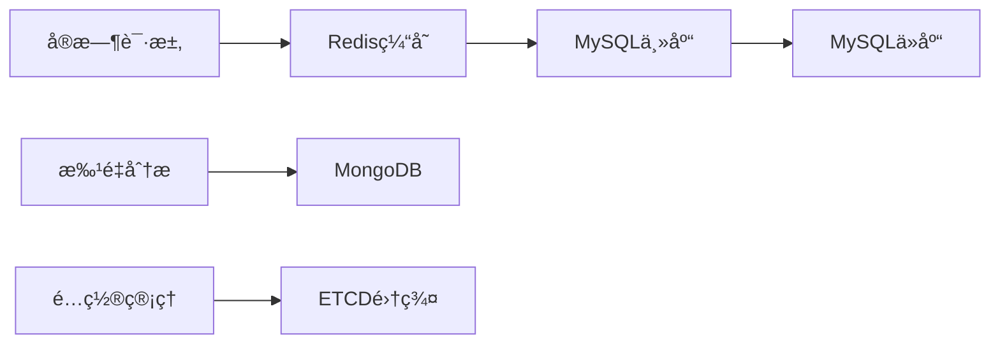
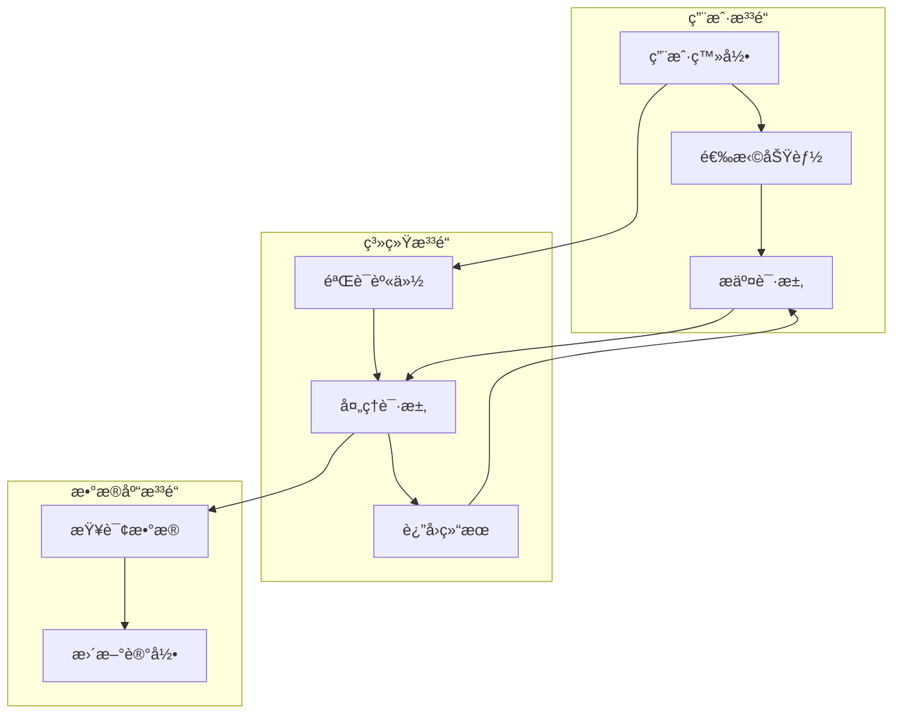
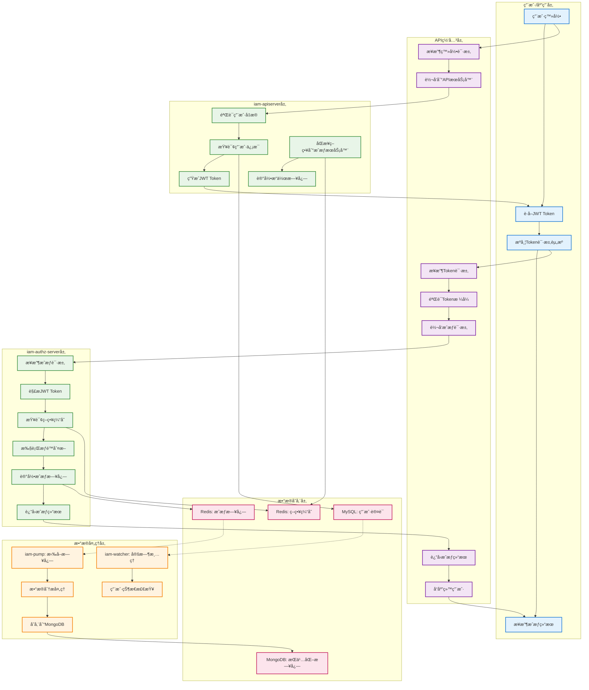
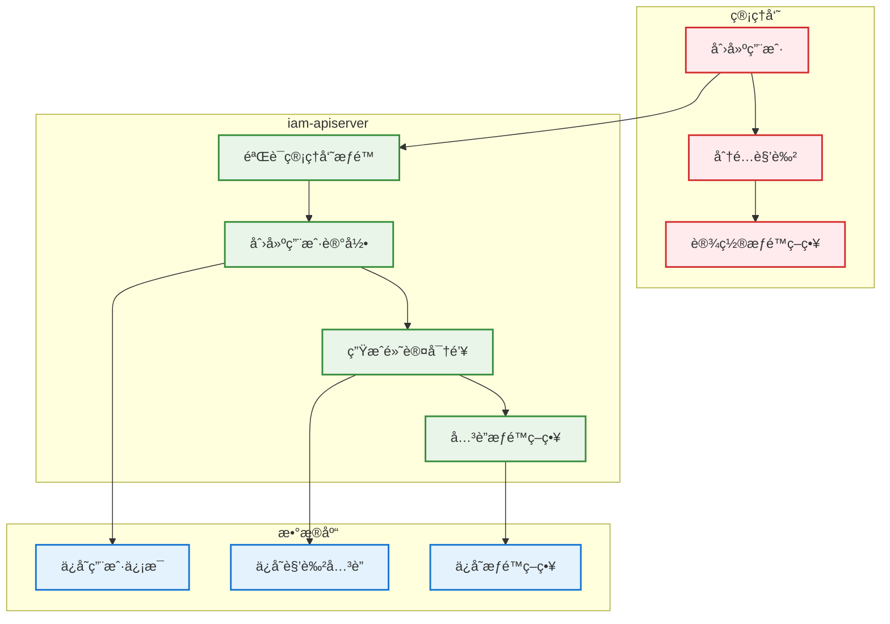
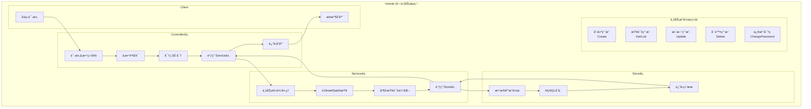
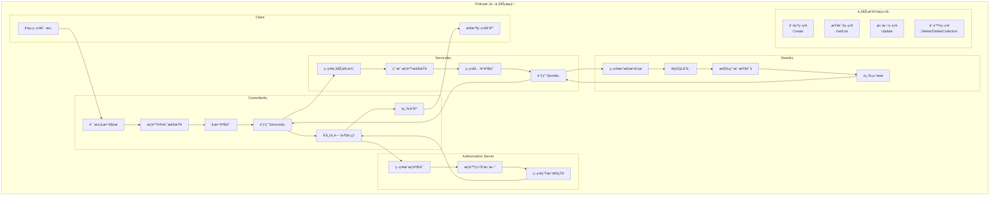

# 解释这个项目, 帮助我快速上手

我æ¥å¸®ä½ å¿«é€Ÿäº†è§£è¿™ä¸ªé¡¹ç›®ã€‚让我先查看项目结æ„和关键文件æ¥ä¸ºä½ æ供全é¢çš„介ç»ã€‚

⺠Update Todos
  â¿  â˜ æŸ¥çœ‹é¡¹ç›®æ ¹ç›®å½•ç»“æ„        
     ☠阅读README文档了解项目概述
     ☠检查é…置文件和ä¾èµ–
     ☠查看主è¦ä»£ç ç»“æ„
     ☠了解APIæ¥å£è®¾è®¡

⺠Update Todos
  â¿  â˜ æŸ¥çœ‹é¡¹ç›®æ ¹ç›®å½•ç»“æ„        
     ☠阅读README文档了解项目概述
     ☠检查é…置文件和ä¾èµ–
     ☠查看主è¦ä»£ç ç»“æ„
     ☠了解APIæ¥å£è®¾è®¡

⺠List(.)
  â¿  Listed 820 paths (ctrl+r to expand)

⺠Read(README.md)
  â¿  Read 91 lines (ctrl+r to expand)

⺠Read(study.md)
  â¿  Error: File does not exist.

⺠Update Todos
  â¿  ☒ æŸ¥çœ‹é¡¹ç›®æ ¹ç›®å½•ç»“æ„        
     ☠阅读README文档了解项目概述
     ☠检查é…置文件和ä¾èµ–
     ☠查看主è¦ä»£ç ç»“æ„
     ☠了解APIæ¥å£è®¾è®¡

⺠Read(go.mod)
  â¿  Read 149 lines (ctrl+r to expand)

⺠Read(Makefile)
  â¿  Read 50 lines (ctrl+r to expand)

⺠Update Todos
  â¿  ☒ æŸ¥çœ‹é¡¹ç›®æ ¹ç›®å½•ç»“æ„        
     ☒ 阅读README文档了解项目概述
     ☒ 检查é…置文件和ä¾èµ–
     ☠查看主è¦ä»£ç ç»“æ„
     ☠了解APIæ¥å£è®¾è®¡

⺠Read(cmd)
  â¿  Error: EISDIR: illegal operation on a directory, read

⺠List(internal)
  â¿  Listed 334 paths (ctrl+r to expand)

⺠Read(docs/guide/zh-CN/installation/installation-architecture.md)
  â¿  Read 30 lines (ctrl+r to expand)

⺠Update Todos
  â¿  ☒ æŸ¥çœ‹é¡¹ç›®æ ¹ç›®å½•ç»“æ„        
     ☒ 阅读README文档了解项目概述
     ☒ 检查é…置文件和ä¾èµ–
     ☒ 查看主è¦ä»£ç ç»“æ„
     ☒ 了解APIæ¥å£è®¾è®¡

⺠IAM - 身份识别ä¸è®¿é—®ç®¡ç†ç³»ç»Ÿå¿«é€Ÿä¸Šæ‰‹æŒ‡å—

  项目概览

  IAM (Identity and Access Management)
  是一个基äºGo语言开å‘çš„ä¼ä¸šçº§èº«ä»½è¯†åˆ«ä¸è®¿é—®ç®¡ç†ç³»ç»Ÿï¼Œå½“å‰ç¨³å®šç‰ˆæœ¬ä¸º v1.6.2。

  核心æ¶æ„

  主è¦ç»„件

  - iam-apiserver - 核心APIæœåŠ¡å™¨ï¼Œæ供用户ã€å¯†é’¥å’Œç­–略的RESTful API
  - iam-authz-server - æˆæƒæœåŠ¡å™¨ï¼Œå¤„ç†èµ„æºè®¿é—®æˆæƒè¯·æ±‚
  - iam-pump - æ•°æ®å¤„ç†æœåŠ¡ï¼Œåˆ†ææˆæƒæ—¥å¿—存储到MongoDB
  - iam-watcher - 定时任务æœåŠ¡ï¼Œå¤„ç†æ•°æ®æ¸…ç†å’Œç”¨æˆ·ç®¡ç†
  - iamctl - 命令行客户端工具

  技术栈

  - 语言: Go 1.21.4
  - Web框æ¶: Gin
  - æ•°æ®åº“: MySQL (主存储) + Redis (缓存) + MongoDB (日志)
  - 认è¯: JWT + Basic Auth
  - API: RESTful + gRPC

  快速开始

  1. ç¯å¢ƒè¦æ±‚

  - CentOS Linux 8.x (æ¨è)
  - Go 1.21.4+
  - æœåŠ¡å™¨éœ€è¦è®¿é—®å¤–网

  2. æ„建项目

  # 克隆代ç 
  git clone https://github.com/marmotedu/iam $GOPATH/src/github.com/marmotedu/iam

  # 编译
  cd $GOPATH/src/github.com/marmotedu/iam
  make

  3. 部署

  å‚考文档：docs/guide/zh-CN/installation/README.md

  项目结æ„

  iam/
  ├── cmd/                 # 主程åºå…¥å£
  │   ├── iam-apiserver/   # APIæœåŠ¡å™¨
  │   ├── iam-authz-server/# æˆæƒæœåŠ¡å™¨
  │   ├── iam-pump/        # æ•°æ®å¤„ç†æœåŠ¡
  │   ├── iam-watcher/     # 定时任务æœåŠ¡
  │   └── iamctl/          # 命令行工具
  ├── internal/            # 内部å®ç°ä»£ç 
  │   ├── apiserver/       # APIæœåŠ¡å™¨å®ç°
  │   ├── authzserver/     # æˆæƒæœåŠ¡å™¨å®ç°
  │   ├── pump/           # æ•°æ®å¤„ç†å®ç°
  │   ├── watcher/        # 任务调度å®ç°
  │   └── pkg/            # 内部公共包
  ├── pkg/                # 外部å¯ç”¨åŒ…
  ├── configs/            # é…置文件
  ├── docs/              # 文档
  └── scripts/           # 脚本工具

  常用命令

  # 编译所有组件
  make build

  # è¿è¡Œæµ‹è¯•
  make test

  # 生æˆæ–‡æ¡£
  make gen.doc

  # 代ç æ ¼å¼åŒ–
  make format

  # 代ç æ£€æŸ¥
  make lint

  核心功能

  - ç”¨æˆ·èº«ä»½ç®¡ç† (å¢åˆ æ”¹æŸ¥)
  - 访问密钥管ç†
  - æˆæƒç­–略管ç†
  - 资æºè®¿é—®æˆæƒ
  - 审计日志记录
  - 分布å¼ç¼“å­˜
  - 高å¯ç”¨éƒ¨ç½²

  学习资æº

  - docs/guide/zh-CN/
  - docs/guide/zh-CN/api/
  - https://time.geekbang.org/column/intro/100079601
  - docs/guide/zh-CN/installation/

  这是一个æˆç†Ÿçš„ä¼ä¸šçº§é¡¹ç›®ï¼Œé€‚åˆå­¦ä¹ Go语言ä¼ä¸šå¼€å‘最佳å®è·µã€‚

  
# 项目业务æ¶æ„图

 æ¶æ„分层

  æ¶æ„图分为两个主è¦æµå‘：
  - æ•°æ®æµï¼ˆå·¦ä¾§ï¼‰ï¼šå¤„ç†æˆæƒè¯·æ±‚和日志数æ®
  - æ§åˆ¶æµï¼ˆå³ä¾§ï¼‰ï¼šç®¡ç†ç”¨æˆ·ã€ç­–略和系统é…ç½®

  核心组件åŠæ•°æ®æµå‘

  1. 管ç†æ§åˆ¶æµç¨‹
  - iam-webconsole：Web管ç†æ§åˆ¶å° → RESTful API → iam-apiserver
  - iamctl：命令行工具 → SDK → iam-apiserver
  - iam-operating-system：è¿è¥ç³»ç»Ÿ → RESTful API → iam-apiserver

  2. æˆæƒæ•°æ®æµç¨‹
  - App：第三方应用 → SDK → iam-authz-server (æˆæƒè¯·æ±‚)
  - iam-authz-server ↔ Redis：缓存策略和日志
  - iam-authz-server ↠gRPC ↠iam-apiserver：拉å–策略数æ®

  3. æ•°æ®å¤„ç†æµç¨‹
  - iam-pump：ä»Redis拉å–日志 → 存储至MongoDB
  - iam-watcher：定时任务处ç†MariaDBæ•°æ®æ¸…ç†

  4. æ•°æ®å­˜å‚¨å±‚
  - MariaDB：æŒä¹…化存储用户ã€å¯†é’¥ã€ç­–ç•¥
  - Redis：缓存æˆæƒç­–略和日志数æ®
  - MongoDB：存储分æåçš„æˆæƒæ—¥å¿—

  关键特性

  - è´Ÿè½½å‡è¡¡ï¼šæ”¯æŒå¤šå®ä¾‹éƒ¨ç½²ï¼Œé€šè¿‡LoadBalance分å‘请求
  - æ•°æ®åˆ†ç¦»ï¼šè¯»å†™åˆ†ç¦»ï¼ŒæˆæƒæœåŠ¡ç‹¬ç«‹ç¼“å­˜æå‡æ€§èƒ½
  - 异步处ç†ï¼šæ—¥å¿—处ç†å’Œæ•°æ®æ¸…ç†å¼‚步执行
  - 多æ¥å£ï¼šæ”¯æŒRESTful APIã€gRPCã€SDK等多ç§è®¿é—®æ–¹å¼

  业务æµç¨‹

  1. 用户通过Webæ§åˆ¶å°æˆ–命令行管ç†èµ„æº
  2. 第三方应用通过SDK请求资æºæˆæƒ
  3. æˆæƒæœåŠ¡æŸ¥è¯¢ç¼“存策略进行æˆæƒå†³ç­–
  4. æˆæƒæ—¥å¿—异步处ç†å’Œå­˜å‚¨
  5. è¿è¥ç³»ç»ŸæŸ¥çœ‹æˆæƒæ•°æ®å’Œç³»ç»Ÿç›‘æ§




  æ¶æ„æµç¨‹è¯´æ˜

  🔄 æ•°æ®æµå‘详解

  1ï¸âƒ£ 管ç†æ§åˆ¶æµ
  - Webæ§åˆ¶å°/è¿è¥ç³»ç»Ÿ → RESTful API → è´Ÿè½½å‡è¡¡å™¨ → iam-apiserver
  - 命令行工具 iamctl → SDK → iam-apiserver
  - iam-apiserver ↔ MariaDB（CRUDæ“作）

  2ï¸âƒ£ æˆæƒæ•°æ®æµ
  - 第三方应用 → SDK → iam-authz-server（æˆæƒè¯·æ±‚）
  - iam-authz-server ↔ Redis（缓存策略ã€å­˜å‚¨æ—¥å¿—）
  - iam-authz-server ↠gRPC ↠iam-apiserver（åŒæ­¥ç­–略）

  3ï¸âƒ£ 日志处ç†æµ
  - iam-pump → Redis（拉å–日志）→ 分æå¤„ç† â†’ MongoDB

  4ï¸âƒ£ 定时维护æµ
  - iam-watcher → MariaDB（数æ®æ¸…ç†ã€ç”¨æˆ·ç®¡ç†ï¼‰

  ğŸ—ï¸ æ¶æ„特点

  | 特性   | è¯´æ˜                 |
  |------|--------------------|
  | 高å¯ç”¨  | è´Ÿè½½å‡è¡¡ + 多å®ä¾‹éƒ¨ç½²       |
  | 高性能  | Redis缓存 + 读写分离     |
  | å¯æ‰©å±•  | å¾®æœåŠ¡æ¶æ„，组件独立         |
  | å¼‚æ­¥å¤„ç† | 日志和清ç†ä»»åŠ¡å¼‚步执行        |
  | 多æ¥å£  | RESTfulã€gRPCã€SDKæ”¯æŒ |

  💾 存储分层

  - MariaDB: 主数æ®å­˜å‚¨ï¼ˆç”¨æˆ·ã€å¯†é’¥ã€ç­–略）
  - Redis: 高性能缓存（策略缓存ã€æˆæƒæ—¥å¿—）
  - MongoDB: æµ·é‡æ—¥å¿—存储（æˆæƒè®°å½•åˆ†æ）

  这个æ¶æ„图清晰地展ç°äº†IAM系统的核心业务æµç¨‹å’ŒæŠ€æœ¯æ¶æ„设计。


# 项目技术æ¶æ„图



## ğŸ—ï¸ æŠ€æœ¯æ¶æ„说æ˜

### 分层æ¶æ„设计

#### 1ï¸âƒ£ 表ç°å±‚ (Presentation Layer)
| 组件 | 技术栈 | èŒè´£ |
|------|-------|------|
| **Web Console** | Vue.js + Element UI | 管ç†ç•Œé¢ï¼Œç”¨æˆ·å‹å¥½çš„æ“ä½œç•Œé¢ |
| **iamctl CLI** | Cobra + Viper | 命令行工具，è¿ç»´å’Œç®¡ç†æ“作 |
| **Go SDK** | marmotedu-sdk-go | å¼€å‘者集æˆåŒ…，简化API调用 |
| **Third Party Apps** | RESTful Client | 第三方应用æ¥å…¥ |

#### 2ï¸âƒ£ API网关层 (Gateway Layer)
```go
// 中间件处ç†é“¾
Request → Load Balancer → CORS → Auth → Rate Limit → Logger → Service
```

| 中间件 | 功能 | 技术å®ç° |
|-------|------|---------|
| **è´Ÿè½½å‡è¡¡** | 请求分å‘ã€å¥åº·æ£€æŸ¥ | Nginx/HAProxy |
| **认è¯æˆæƒ** | JWT验è¯ã€Basic Auth | gin-jwt/v2 |
| **é™æµæ§åˆ¶** | Token Bucket算法 | golang.org/x/time/rate |
| **请求日志** | 结æ„化日志记录 | Zap + Context |

#### 3ï¸âƒ£ 业务æœåŠ¡å±‚ (Service Layer)

**iam-apiserver 核心模å—**
```go
// 代ç ç»“æ„
internal/apiserver/
├── controller/v1/    # æ§åˆ¶å™¨å±‚
│   ├── user/        # 用户管ç†
│   ├── secret/      # å¯†é’¥ç®¡ç†  
│   └── policy/      # 策略管ç†
├── service/v1/      # 业务逻辑层
├── store/           # æ•°æ®è®¿é—®å±‚
│   ├── mysql/       # MySQLå®ç°
│   ├── etcd/        # ETCDå®ç°
│   └── fake/        # 测试å®ç°
└── options/         # é…置选项
```

**iam-authz-server æˆæƒå¼•æ“**
```go
// æˆæƒæµç¨‹
Request → JWTéªŒè¯ â†’ ç­–ç•¥åŒ¹é… â†’ æƒé™åˆ¤æ–­ → 审计日志 → Response
```

#### 4ï¸âƒ£ 框æ¶å±‚ (Framework Layer)
| 框æ¶/库 | 版本 | 用途 |
|---------|------|------|
| **Gin** | v1.7.4 | HTTP路由和中间件 |
| **GORM** | v1.22.4 | ORMæ•°æ®åº“æ“作 |
| **go-redis** | v8.11.4 | Redis客户端 |
| **mongo-driver** | 官方驱动 | MongoDBæ“作 |
| **etcd/clientv3** | v3.5.0 | é…置中心客户端 |

#### 5ï¸âƒ£ 存储层 (Storage Layer)

**æ•°æ®åˆ†å±‚存储策略**


| 存储 | 用途 | 特性 |
|------|------|------|
| **MySQL** | 主数æ®å­˜å‚¨ | ACID事务ã€ä¸»ä»å¤åˆ¶ |
| **Redis** | 缓存+ä¼šè¯ | 高性能ã€æŒä¹…化 |
| **MongoDB** | 日志分æ | 分片集群ã€çµæ´»æ–‡æ¡£ |
| **ETCD** | é…置中心 | 强一致性ã€æœåŠ¡å‘ç° |

#### 6ï¸âƒ£ è¿ç»´å±‚ (Operations Layer)

**å¯è§‚测性三支柱**
- **Metrics**: Prometheus收集性能指标
- **Tracing**: Jaeger分布å¼é“¾è·¯è¿½è¸ª  
- **Logging**: ELK Stack日志èšåˆåˆ†æ

### 🔧 核心技术特性

#### 高å¯ç”¨è®¾è®¡
- **无状æ€æœåŠ¡**: æœåŠ¡å®ä¾‹å¯æ°´å¹³æ‰©å±•
- **æ•°æ®åº“集群**: 主ä»å¤åˆ¶ã€è¯»å†™åˆ†ç¦»
- **缓存集群**: Redis Cluster模å¼
- **è´Ÿè½½å‡è¡¡**: 多å®ä¾‹å¥åº·æ£€æŸ¥

#### 高性能优化
- **è¿æ¥æ± **: æ•°æ®åº“è¿æ¥å¤ç”¨
- **缓存策略**: 多级缓存（本地+分布å¼ï¼‰
- **异步处ç†**: 日志和统计任务解耦
- **批é‡æ“作**: å‡å°‘æ•°æ®åº“交互次数

#### 安全性ä¿éšœ
- **认è¯æœºåˆ¶**: JWT + Basic AuthåŒé‡è®¤è¯
- **æƒé™æ§åˆ¶**: RBAC细粒度æˆæƒ
- **æ•°æ®åŠ å¯†**: æ•æ„Ÿæ•°æ®AES加密存储
- **安全审计**: 完整的æ“作日志追踪

这个技术æ¶æ„图展ç°äº†IAM系统完整的技术栈和分层设计，是学习ä¼ä¸šçº§Go项目æ¶æ„的优秀范例。

## ğŸŠâ€â™€ï¸ IAM业务æµç¨‹æ³³é“图



### 用户认è¯æˆæƒæµç¨‹



### 🔄 æµç¨‹è¯´æ˜

#### 认è¯æµç¨‹ (Authentication Flow)
1. **用户登录** → API网关 → iam-apiserver
2. **验è¯å‡­æ®** → 查询MySQL用户数æ®
3. **生æˆJWT** → è¿”å›ç»™ç”¨æˆ·
4. **ç­–ç•¥åŒæ­¥** → æ¨é€åˆ°iam-authz-server缓存

#### æˆæƒæµç¨‹ (Authorization Flow)  
1. **æºå¸¦Token请求资æº** → API网关验è¯
2. **转å‘æˆæƒè¯·æ±‚** → iam-authz-server
3. **JWT解æ验è¯** → 查询Redis策略缓存
4. **æƒé™åˆ¤æ–­** → è¿”å›æˆæƒç»“æœ
5. **记录日志** → 存储到Redis

#### 异步处ç†æµç¨‹ (Async Processing)
1. **iam-pump** → ä»Redis拉å–æˆæƒæ—¥å¿—
2. **æ•°æ®åˆ†æ** → 存储到MongoDB
3. **iam-watcher** → 定时清ç†è¿‡æœŸæ•°æ®

### æ³³é“图特点
- **清晰分层**: æ¯ä¸ªæ³³é“代表ä¸åŒçš„系统层次
- **æµç¨‹å¯è§†**: 直观展ç°æ•°æ®æµå‘和处ç†æ­¥éª¤  
- **异步处ç†**: 虚线表示异步æ“作
- **颜色区分**: ä¸åŒé¢œè‰²ä»£è¡¨ä¸åŒç³»ç»Ÿç»„件

## 🯠其他业务æµç¨‹æ³³é“图

### 用户管ç†æµç¨‹



这样的泳é“图清晰地展ç°äº†IAM系统中ä¸åŒè§’色和组件之间的交互æµç¨‹ï¼Œé常适åˆç³»ç»Ÿè®¾è®¡æ–‡æ¡£å’ŒæŠ€æœ¯äº¤æµã€‚

# 业务模å—
IAM项目代ç ç»“æ„，我å¯ä»¥çœ‹åˆ°è¿™ä¸ªé¡¹ç›®ä¸»è¦åŒ…å«ä»¥ä¸‹å‡ ä¸ªä¸šåŠ¡æ¨¡å—：

  3个核心业务模å—

  1. User（用户管ç†ï¼‰ - 用户的创建ã€åˆ é™¤ã€æ›´æ–°ã€æŸ¥è¯¢ã€å¯†ç ä¿®æ”¹ç­‰åŠŸèƒ½
  2. Policy（策略管ç†ï¼‰ - æƒé™ç­–略的创建ã€åˆ é™¤ã€æ›´æ–°ã€æŸ¥è¯¢ç­‰åŠŸèƒ½
  3. Secret（密钥管ç†ï¼‰ - API密钥的创建ã€åˆ é™¤ã€æ›´æ–°ã€æŸ¥è¯¢ç­‰åŠŸèƒ½

  4个系统æœåŠ¡æ¨¡å—

  1. iam-apiserver - APIæœåŠ¡å™¨ï¼Œæä¾›REST APIæ¥å£
  2. iam-authz-server - æˆæƒæœåŠ¡å™¨ï¼Œå¤„ç†æˆæƒé€»è¾‘
  3. iam-pump - æ•°æ®æ³µæœåŠ¡ï¼Œè´Ÿè´£æ•°æ®åˆ†æ和导出
  4. iam-watcher - 监æ§æœåŠ¡ï¼Œè´Ÿè´£ç³»ç»Ÿç›‘æ§å’Œæ¸…ç†ä»»åŠ¡

  1个命令行工具模å—

  1. iamctl - 命令行客户端工具，用äºç®¡ç†IAM系统

  总共有8个模å—，其中3个是核心业务功能模å—，4个是系统æœåŠ¡æ¨¡å—，1个是客户端
  工具模å—。


# 业务模å—æ³³é“图

1. User模å—业务泳é“图



⺠2. Policy模å—业务泳é“图



⺠3. Secret模å—业务泳é“图


⺠以上就是IAM项目三个核心业务模å—的业务泳é“图：

  1. User模å—：负责用户生命周期管ç†ï¼ŒåŒ…括创建ã€æŸ¥è¯¢ã€æ›´æ–°ã€åˆ é™¤å’Œå¯†ç ä¿®æ”¹
  2. Policy模å—：负责æƒé™ç­–略管ç†ï¼Œä¸æˆæƒæœåŠ¡å™¨å调处ç†æƒé™æ§åˆ¶
  3. Secret模å—：负责API密钥管ç†ï¼Œä¸ºAPI访问æ供安全认è¯

  æ¯ä¸ªæ¨¡å—都éµå¾ªController→Service→Store的三层æ¶æ„，并ä¸Authorization
  Server进行æƒé™éªŒè¯å’ŒçŠ¶æ€åŒæ­¥ã€‚